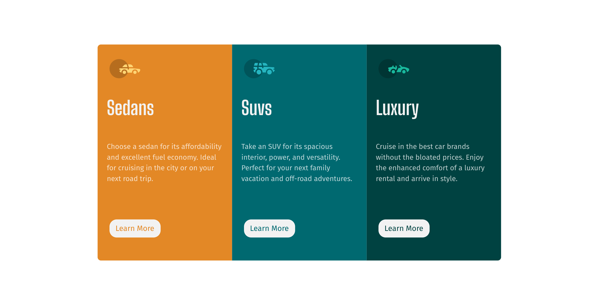

# Frontend Mentor - 3-column preview card component solution

This is a solution to the [3-column preview card component challenge on Frontend Mentor](https://www.frontendmentor.io/challenges/3column-preview-card-component-pH92eAR2-). Frontend Mentor challenges help you improve your coding skills by building realistic projects. 

## Table of contents

- [Overview](#overview)
  - [The challenge](#the-challenge)
  - [Screenshot](#screenshot)
  - [Links](#links)
- [My process](#my-process)
  - [Built with](#built-with)
  - [What I learned](#what-i-learned)
  - [Continued development](#continued-development)
  - [Useful resources](#useful-resources)
- [Author](#author)
- [Acknowledgments](#acknowledgments)

## Overview

### The challenge

Users should be able to:

- View the optimal layout depending on their device's screen size
- See hover states for interactive elements

### Screenshot

#### Desktop Version

#### Mobile Version

### Links

- Solution URL: [Solution](https://github.com/terryyufei/frontend_mentor-3-column-preview-card-component)
- Live Site URL: [Live site](https://terryyufei.github.io/frontend_mentor-3-column-preview-card-component/)

## My process

### Built with

- Semantic HTML5 markup
- CSS custom properties
- Flexbox
- Bootstrap
- Desktop-first workflow

### What I learned

I learned even with Bootstrap I still have to write media queries.

### Continued development

Learn more Bootstrap

### Useful resources

- [Bootstrap](https://getbootstrap.com/docs/5.2/layout/grid/) 
- [chatGPT](https://chat.openai.com/) 

## Author

- Website - [Portfolio](https://portfolio-tau-two-84.vercel.app/)
- Frontend Mentor - [@terryyufei](https://www.frontendmentor.io/profile/terryyufei)
- Twitter - [@Mssophia_](https://twitter.com/Mssophia_)
